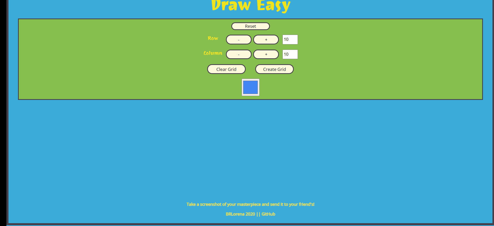

# 💻 About Draw Easy

  Draw Easy is a project developed in javaScript, jQuery, html and css. That I aimed to test knowledge of logic in JS. Draw something with this simple, intuitive and fun application.  
  <button><a href="https://brlorena.github.io/Draw_Easy_JS/" target="_blank" style="text-decoration: none;">Draw Something 😃</a></button>  
  
# 📷 How to use it

 ✔️ Dynamically define the table size as a row by column grid.  
 ✔️ Choose a color .  
 ✔️ Click on a cell in the created grid to fill it with a chosen color.   
   

# Implemented resources

- Paint by clicking and dragging the mouse. 
- Erase on the second click, it also works with dragging. 
- Substitua uma cor com um único clique. 
- Add or remove columns or rows at any time without redefining the drawing. 
- Add / remove individual rows/columns with the +/- buttons. Also add several by clicking and holding. 
- Add / remove rows / columns by typing values ​​manually or using the arrow followed by the plus and minus buttons to create the grid. 
- Only valid size allowed (between 1-150). The buttons will stop at the invalid entry, manual entry will revert to the nearest valid one. 
- Using the button <button>Clear Grid</button> cleans the design and maintains the same grid size. 
- The button <button>Reset </button> takes the page back to default values. 
- Responsive on cell phone. It has a vertical layout to be used on very narrow screens.
  

# 🚀 Tecnologies

- HTML
- CSS
- JavaScript
- jQuery